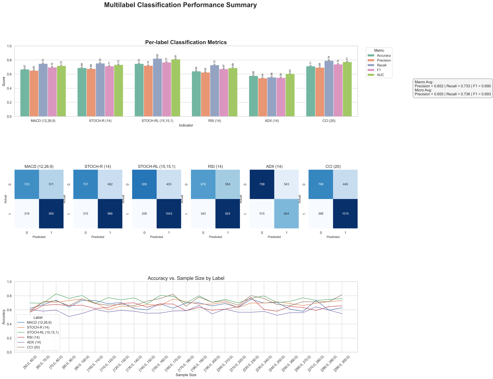
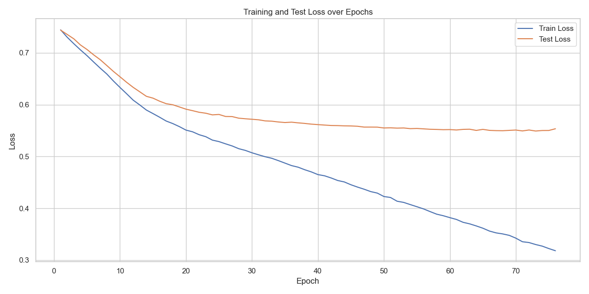
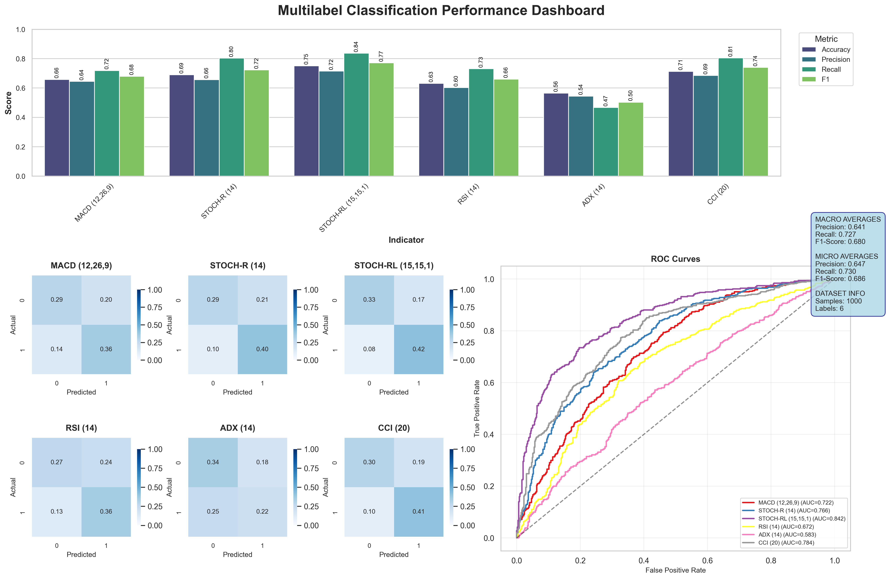

### Top 3 Unscaled Models Performance

| Model Name         | Accuracy Plot                      | Loss Plot                        |
|--------------------|----------------------------------|---------------------------------|
| resnet_multilabel2   |     |    |
| VIT_128      |        |       |
| squeezenet_multilabel| |  |


# 📚 Training & Model Usage Guide

This guide explains how to prepare your data, train models, and run inference using the code in this repository.

---

## 🛠️ 1. Data Creation from Excel Files

To generate training and testing images from financial time series stored in Excel files, follow the steps below.

### 📈 How It Works:

- Reads time series data from one or multiple Excel sheets.
- Extracts selected financial indicators (MACD, RSI, etc.).
- Randomly samples sequences of varying lengths.
- Plots these sequences as multi-line RGB graphs (each indicator as a color).
- Saves the graphs as `.png` images and the corresponding data as `.csv` files.

### 📄 Input:

- An Excel file (`.xlsx`) containing multiple sheets with time series data.
- Each sheet should include the relevant indicators you wish to visualize.

### 🖼️ Output:

- A folder with images (`.png`) of plotted time series.
- Optionally: CSV files of the original data slices.

Example output folder:
```
DATA_DIR/
├── train/
│   ├── EURUSDm1_0.png
│   ├── EURUSDm1_0.csv
│   └── ...
├── test/
│   ├── EURUSDm5_p2_0.png
│   └── ...
│
LABELS_DIR/
├── train_labels.json
└── test_labels.json
```

### ⚙️ Running the Script

1. Set the following variables in your `.env` file:

```
DATA_DIR=/path/to/output/folder
SCALER_DIR=/path/to/scaler/folder
LABELS_DIR=/pat/to/labels/folder
INDICS=['indic_1', ...]
TRAIN_SHEETS=['train_sheet_1', ...]
TEST_SHEETS=['test_sheet_1', ...]
```

2. Here is a script you can run to create data:

```python
from data_processing.create_training_data import create_graphs
from data_processing.preprocessing import ECDFScaler
from general_utils import load_json_list
import os

DATA_DIR = os.getenv('DATA_DIR')
SCALER_DIR = os.getenv('SCALER_DIR')
INDICS = load_json_list("INDICS")
train_sheets = load_json_list("TRAIN_SHEETS")
test_sheets = load_json_list("TEST_SHEETS")

excel = 'your_excel_db.xlsx'

# Paths
train_dir = os.path.join(DATA_DIR, 'your_train_dir')
test_dir = os.path.join(DATA_DIR, 'your_test_dir')

# Here is a script you can run to create your data
scaler = ECDFScaler()
scaler.fit_excel_sheets(excel, sheet_names=train_sheets, names = INDICS)
scaler.save(os.path.join(SCALER_DIR,"your_scaler.pkl"))

scaler = ECDFScaler.load(os.path.join(SCALER_DIR,"your_scaler.pkl"))


# Create Training Images
create_graphs(file_name, train_dir, train_sheets, replace=True, indics=INDICS, scaler=scaler)

# Create Testing Images
create_graphs(file_name, test_dir, test_sheets, replace=True, test=True, indics=INDICS, scaler=scaler)
```

✅ You can adjust:
- Number of graphs per sheet (`nb_graphs_per_thousand`)
- Minimum/maximum time window sizes (`min_size`, `max_size`)
- Image dimensions (`graph_size`)


3. Now we have to put label on the data:

```python
from data_processing.dataset import label_data
from general_utils import load_json_list
import os

LABELS_DIR = os.getenv('LABELS_DIR')

labels_paths = [os.path.join(LABELS_DIR,'your_train_labels.json'),os.path.join(LABELS_DIR,'your_test_labels.json')]

data_folders = [train_sheets, test_sheets]


for labels_path, data_folder in zip(labels_paths, data_folders) :
    label_data(data_folder, labels_path, INDICS)
```
---

👉 Once the data is created, you can proceed to model training as described in the next section.

---

## 🏋️ 2. Model Training

Once your data is generated and labeled, you can train models using the provided code.

1. Set the following variables in your `.env` file adding to the previous ones :

```
MODEL_DIR=/path/to/models/folder
```

Here is a full example script to train a model:

```python
from dotenv import load_dotenv
import torch
import os
from general_utils import load_json_list
from data_processing.dataset import get_train_val_loaders
from data_processing.preprocessing import get_pos_weights
from models_architectures.squeezenet import SqueezeNet_Multilabel
from models_architectures.vit import ViTMultiLabelClassifierModel
from models_architectures.resnet import Resnet_18_Multilabel
from models_architectures.training import train_network, plot_loss

## Define paths and model parameters

load_dotenv()

DEVICE = torch.device("cuda" if torch.cuda.is_available() else "cpu")

DATA_DIR = os.getenv("DATA_DIR")

TRAIN_DIR = os.path.join(DATA_DIR, "your_train_dir")
TEST_DIR = os.path.join(DATA_DIR, "your_test_dir")

LABELS_DIR = os.getenv("LABELS_DIR")
TRAIN_LABEL_FILE = "your_train_labels.json"
TEST_LABEL_FILE = "your_test_labels.json"
TRAIN_LABEL_PATH = os.path.join(LABELS_DIR, TRAIN_LABEL_FILE)
TEST_LABEL_PATH = os.path.join(LABELS_DIR, TEST_LABEL_FILE)

BATCH_SIZE = 32

INDICS = load_json_list("INDICS")

LEARNING_RATE = 0.0001
WEIGHT_DECAY = 0.0001
BATCH_SIZE = 32
NUM_EPOCHS = 100
IMAGE_SIZE = 256

# Only for VIT
PATCH_SIZE = 6 
NUM_PATCHES = (IMAGE_SIZE // PATCH_SIZE) ** 2
PROJECTION_DIM = 64
NUM_HEADS = 4
TRANSFORMER_LAYERS = 8
MLP_HEAD_UNITS = [2048, 1024]

MODEL_DIR = os.getenv('MODEL_DIR')
MODEL_NAME = 'VIT_' + str(IMAGE_SIZE) # Change this when you train different models and you want to keep them all
MODEL_FILE = MODEL_NAME + '.pth'
MODEL_PATH = os.path.join(MODEL_DIR, MODEL_FILE)

PERF_DIR = os.getenv('PERF_DIR')
LOSS_FILE = MODEL_NAME + '_loss.png'
LOSS_PATH = os.path.join(PERF_DIR, LOSS_FILE)

## Get the dataloaders and the model

train_loader, train_dataset, val_loader, val_dataset = get_train_val_loaders(train_image_dir = TRAIN_DIR, train_labels_path = TRAIN_LABEL_PATH, test_image_dir = TEST_DIR, test_labels_path = TEST_LABEL_PATH, train_batch_size=BATCH_SIZE, img_size=IMAGE_SIZE, adapt_scaling = True)

# model = Resnet_18_Multilabel(num_classes = 6).to(DEVICE)

# model = SqueezeNet_Multilabel(num_classes = 6).to(DEVICE)

model = ViTMultiLabelClassifierModel(
    num_transformer_layers = TRANSFORMER_LAYERS,
    embed_dim = PROJECTION_DIM,
    feed_forward_dim = PROJECTION_DIM * 2,
    num_heads = NUM_HEADS,
    patch_size = PATCH_SIZE,
    num_patches = NUM_PATCHES,
    mlp_head_units = MLP_HEAD_UNITS,
    num_classes = 6,
    device = DEVICE,
).to(DEVICE)

## Define optimizer and loss function

optimizer = torch.optim.AdamW(
    params=filter(lambda param: param.requires_grad, model.parameters()),
    lr=LEARNING_RATE,
    weight_decay=WEIGHT_DECAY,)

pos_weights = get_pos_weights(train_loader, device = DEVICE) 
loss_function = torch.nn.BCEWithLogitsLoss(pos_weight=pos_weights)

## Training loop

print(f"Training of {MODEL_PATH}")
history = train_network(
    model = model,
    num_epochs = NUM_EPOCHS,
    optimizer = optimizer,
    loss_function = loss_function,
    trainloader = train_loader,
    validloader = val_loader,
    device = DEVICE,
    export_path = MODEL_PATH
)

plot_loss(train_losses = history['train_loss'], 
          val_losses = history['test_loss'], 
          model_name = MODEL_NAME, 
          save_path = LOSS_PATH)
```