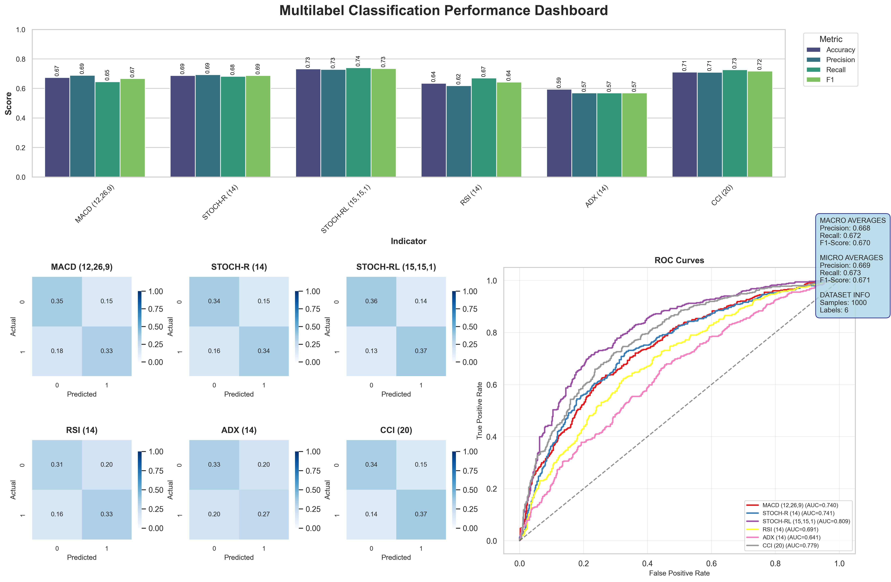

### Top 3 Unscaled Models Performance

| Model Name         | Accuracy Plot                      | Loss Plot                        |
|--------------------|----------------------------------|---------------------------------|
| resnet_multilabel2   |     |    |
| VIT_128      |        |       |
| squeezenet_multilabel| |  |


# 📚 Training & Model Usage Guide

This guide explains how to prepare your data, train models, and run inference using the code in this repository.

---

## 🛠️ 1. Data Creation from Excel Files

To generate training and testing images from financial time series stored in Excel files, follow the steps below.
### 📈 How It Works:

- Reads time series data from one or multiple Excel sheets.
- Extracts selected financial indicators (MACD, RSI, etc.).
- Randomly samples sequences of varying lengths.
- Plots these sequences as multi-line RGB graphs (each indicator as a color).
- Saves the graphs as `.png` images and the corresponding data as `.csv` files.

### 📄 Input:

- An Excel file (`.xlsx`) containing multiple sheets with time series data.
- Each sheet should include the relevant indicators you wish to visualize.

### 🖼️ Output:

- A folder with images (`.png`) of plotted time series.
- Optionally: CSV files of the original data slices.

Example output folder:
```
data/
├── train/
│   ├── AAPL_0.png
│   ├── AAPL_0.csv
│   └── ...
├── test/
│   ├── AMZN_0.png
│   ├── AMZN_0.csv
│   └── ...
│
labels/
├── train_labels.json
└── test_labels.json
```

### 📝 Required Environment Variables

```
DATA_DIR=data
SCALER_DIR=scalers
LABELS_DIR=labels
INDICS=["MACD (12,26,9)", "STOCH-R (14)", "STOCH-RL (15,15,1)", "RSI (14)", "ADX (14)", "CCI (20)"]
TRAIN_SHEETS=["BIIB", "WMT", "KO", "CAT", "BA", "MMM", "AAPL"]
TEST_SHEETS=["HON", "AMZN", "NVDA", "BAC", "JPM", "XOM", "TSLA", "NKE"]
```

### ⚙️ Script to create data images

Here is an example of data creation using the unscaled ```Base_Test_2500pts v-Louis.xlsx``` Excel database.
I strongly recommend using the keywords ```synth``` and/or ```scaled``` in the models/labels/images paths if the data comes from ```Base_Test_2500pts avec Synthétiques.xlsx``` and/or has been scaled (currently, the only implemented scaling option is distribution uniformization). This is important because, during inference, many details are extracted from the model path.

```python
from data_processing.create_training_data import create_graphs
from data_processing.preprocessing import ECDFScaler
from general_utils import load_json_list
import os

DATA_DIR = os.getenv('DATA_DIR')
SCALER_DIR = os.getenv('SCALER_DIR')
INDICS = load_json_list("INDICS")
train_sheets = load_json_list("TRAIN_SHEETS")
test_sheets = load_json_list("TEST_SHEETS")

excel = 'Base_Test_2500pts v-Louis.xlsx'

# Paths
train_dir = os.path.join(DATA_DIR, 'train')
test_dir = os.path.join(DATA_DIR, 'test')

scaler = None

# Optionnal if you want to uniformize indicator's distibutions
# scaler = ECDFScaler()
# scaler.fit_excel_sheets(excel, sheet_names=train_sheets, names = INDICS)
# scaler.save(os.path.join(SCALER_DIR,"ecdf_scaler.pkl"))

# scaler = ECDFScaler.load(os.path.join(SCALER_DIR,"ecdf_scaler.pkl"))

# Create Training Images
create_graphs(excel, train_dir, train_sheets, replace=True, indics=INDICS, scaler=scaler)

# Create Testing Images
create_graphs(excel, test_dir, test_sheets, replace=True, test=True, indics=INDICS, scaler=scaler)
```

✅ You can adjust:
- Number of graphs per sheet (`nb_graphs_per_thousand`)
- Minimum/maximum time window sizes (`min_size`, `max_size`)
- Image dimensions (`graph_size`)


### ⚙️ Script to label created data

```python
from data_processing.dataset import label_data
from general_utils import load_json_list
import os

LABELS_DIR = os.getenv('LABELS_DIR')

labels_paths = [os.path.join(LABELS_DIR,'train_labels.json'),os.path.join(LABELS_DIR,'test_labels.json')]

data_folders = [train_sheets, test_sheets]


for labels_path, data_folder in zip(labels_paths, data_folders) :
    label_data(data_folder, labels_path, INDICS)
```

### ⚠️ Limitations

This project is designed to work with the provided Excel files. If you want to use your own data, make sure to update the column and sheet names everywhere they appear.

Additionally, you will need to add the corresponding information to the ```mean_std.json``` file and the ```scalers``` folder.

For inference, if you add new suffixes, you must modify the ```extract_config``` function in ```model_evaluation/inference_pipeline``` so it can handle them.


---

## 🏋️ 2. Model Training

This section explains how to train models on the data.

Once the data is generated and labeled, you can train models using the provided code.

### 📝 Required Environment Variables

```
DATA_DIR=data
SCALER_DIR=scalers
LABELS_DIR=labels
MODEL_DIR=model
INDICS=["MACD (12,26,9)", "STOCH-R (14)", "STOCH-RL (15,15,1)", "RSI (14)", "ADX (14)", "CCI (20)"]
```

### ⚙️ Script for model training

```python
from dotenv import load_dotenv
import torch
import os
from general_utils import load_json_list
from data_processing.dataset import get_train_val_loaders
from data_processing.preprocessing import get_pos_weights
from models_architectures.squeezenet import SqueezeNet_Multilabel
from models_architectures.vit import ViTMultiLabelClassifierModel
from models_architectures.resnet import Resnet_18_Multilabel
from models_architectures.training import train_network, plot_loss

## Define paths and model parameters

load_dotenv()

DEVICE = torch.device("cuda" if torch.cuda.is_available() else "cpu")

DATA_DIR = os.getenv("DATA_DIR")

TRAIN_DIR = os.path.join(DATA_DIR, "train")
TEST_DIR = os.path.join(DATA_DIR, "test")

LABELS_DIR = os.getenv("LABELS_DIR")
TRAIN_LABEL_FILE = "train_labels.json"
TEST_LABEL_FILE = "test_labels.json"
TRAIN_LABEL_PATH = os.path.join(LABELS_DIR, TRAIN_LABEL_FILE)
TEST_LABEL_PATH = os.path.join(LABELS_DIR, TEST_LABEL_FILE)

BATCH_SIZE = 32

INDICS = load_json_list("INDICS")

LEARNING_RATE = 0.0001
WEIGHT_DECAY = 0.0001
BATCH_SIZE = 32
NUM_EPOCHS = 100
IMAGE_SIZE = 256

# Only for VIT
PATCH_SIZE = 6 
NUM_PATCHES = (IMAGE_SIZE // PATCH_SIZE) ** 2
PROJECTION_DIM = 64
NUM_HEADS = 4
TRANSFORMER_LAYERS = 8
MLP_HEAD_UNITS = [2048, 1024]

MODEL_DIR = os.getenv('MODEL_DIR')
MODEL_NAME = 'VIT_' + str(IMAGE_SIZE) + "_example" # Change this when you train different models and you want to keep them all
MODEL_FILE = MODEL_NAME + '.pth'
MODEL_PATH = os.path.join(MODEL_DIR, MODEL_FILE)

PERF_DIR = os.getenv('PERF_DIR')
LOSS_FILE = MODEL_NAME + '_loss.png'
LOSS_PATH = os.path.join(PERF_DIR, LOSS_FILE)

## Get the dataloaders and the model

train_loader, train_dataset, val_loader, val_dataset = get_train_val_loaders(train_image_dir = TRAIN_DIR, train_labels_path = TRAIN_LABEL_PATH, test_image_dir = TEST_DIR, test_labels_path = TEST_LABEL_PATH, train_batch_size=BATCH_SIZE, img_size=IMAGE_SIZE, adapt_scaling = True)

# model = Resnet_18_Multilabel(num_classes = 6).to(DEVICE)

# model = SqueezeNet_Multilabel(num_classes = 6).to(DEVICE)

model = ViTMultiLabelClassifierModel(
    num_transformer_layers = TRANSFORMER_LAYERS,
    embed_dim = PROJECTION_DIM,
    feed_forward_dim = PROJECTION_DIM * 2,
    num_heads = NUM_HEADS,
    patch_size = PATCH_SIZE,
    num_patches = NUM_PATCHES,
    mlp_head_units = MLP_HEAD_UNITS,
    num_classes = 6,
    device = DEVICE,
).to(DEVICE)

## Define optimizer and loss function

optimizer = torch.optim.AdamW(
    params=filter(lambda param: param.requires_grad, model.parameters()),
    lr=LEARNING_RATE,
    weight_decay=WEIGHT_DECAY,)

pos_weights = get_pos_weights(train_loader, device = DEVICE) 
loss_function = torch.nn.BCEWithLogitsLoss(pos_weight=pos_weights)

## Training loop

print(f"Training of {MODEL_PATH}")
history = train_network(
    model = model,
    num_epochs = NUM_EPOCHS,
    optimizer = optimizer,
    loss_function = loss_function,
    trainloader = train_loader,
    validloader = val_loader,
    device = DEVICE,
    export_path = MODEL_PATH
)

plot_loss(train_losses = history['train_loss'], 
          val_losses = history['test_loss'], 
          model_name = MODEL_NAME, 
          save_path = LOSS_PATH)
```
### ⚠️ Limitations

This project is designed to work with the provided classifier classes. The custom functions used to load these models might not be compatible with new architectures.
If you want to define your own models, you will probably need to modify the ```general.py``` and ```utils.py``` files in ```models_architectures/``` accordingly.

## 🔍 3. Inference Pipeline

This section explains how to use the pre-trained models for inference on new data.

### 📝 Required Environment Variables

```
SCALER_DIR=scalers
MODEL_DIR=model
APIKEY=your_fmp_api_key
MODELS_NOT_NORM #: keep it that way (or at least do not remove anything)
```

---

### ⚙️ Script to run inference on new data

```python
import os
from external.tcopil2025.fmpapi import get_fmp_data
from model_evaluation.inference import inference_pipeline
from general_utils import load_json_list
from dotenv import load_dotenv

# Load environment
load_dotenv()

MODEL_DIR = os.getenv('MODEL_DIR')
SCALER_DIR = os.getenv('SCALER_DIR')
APIKEY = os.getenv('APIKEY')

# List your models
model_files = [
    'VIT_256_example'  # Add more models as needed
]

model_paths = [os.path.join(MODEL_DIR, f) for f in model_files]

# Load exceptions for models that don't require normalization
model_paths_not_normalized = load_json_list("MODELS_NOT_NORM")

# Fetch financial data (FMP API)
symbol = "AAPL"
interval = "30min"
data = get_fmp_data(symbol=symbol, interval=interval, APIKEY=APIKEY)

# Run inference pipeline
results_df, history_df = inference_pipeline(
    model_paths=model_paths,
    data=data,
    n_avg=9,
    model_paths_not_normalized=model_paths_not_normalized
)

print(results_df)
```

---

### 📊 Outputs

- `results_df` : DataFrame containing predictions per model and per date
- `history_df` : The historical data with computed indicators

---

✅ **Notes:**

- The function `prepare_augmented_df` creates multiple versions of the input data by sampling different windows, which improves prediction stability.
- The models are automatically scaled and normalized (if required) based on their filenames and settings.
- Supported model architectures include **ResNet**, **Vision Transformer (ViT)**, **SqueezeNet**, or any custom model saved using the provided training code.
